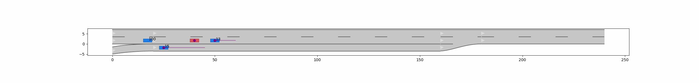

# Adaptive Splitting of Reusable Temporal Monitors for Rare Traffic Violations

This is the accompanying code-base for the paper (NOTE: Paper available soon):

[Adaptive Splitting of Reusable Temporal Monitors for Rare Traffic Violations](www.google.com)

## Setup

### Installation Prerequisites

To install required libraries, run:

    pip install -r requirements.txt

The MPC-controller for the Automated Vehicle uses [Gurobi](https://www.gurobi.com) for Non-Linear Program Solving, so you will need a [License](https://www.gurobi.com/academia/academic-program-and-licenses/).

## Running Experiments

### "Ground Truth" Simulations

To run PEM experiments using standard monte-carlo sampling, use:

    python GrountTruthNaive.py <num-experiments> <exp_name> <save_root>

Where arguments are:
- `num-experiments` - the number of simulations that will be sampled
- `exp-name` - The name of the experiment (used to create file names)
- `save-root` - The root folder where results will be saved

### Importance Sampler Baseline

To run PEM experiments using the `Imp-CE` baseline, use:

    python ScenarioImportanceSampling.py <num-experiments> <rule-name> <exp-name> <save-root>

Where arguments are:
- `num-experiments` - The number of simulations that will be sampled
- `rule-name` - Determines which rule is used for cross-entropy learning. Choose between `rg_1`, `rg_2`, `rg_4`, and `ri_1` (Corresponding to rules given in ) [Formalization of Interstate Traffic Rules in Temporal Logic](https://ieeexplore.ieee.org/abstract/document/9304549)
- `exp-name` - The name of the experiment (used to create file names)
- `save-root` - The root folder where results will be saved

### Adaptive Multilevel Splitting

To run PEM experiments using `STL-AMS`, use:

    python adaptiveMultilevelSplit.py <num-experiments> <discard-prop> <rule-name> <exp-name> <save-root>

Where arguments are:
- `num-experiments` - The number of simulations that will be sampled
- `discard_prop` - Sets discard amount `K` as `discard_prop * num-experiments`
- `rule-name` - Determines which rule is used for cross-entropy learning. Choose between `rg_1`, `rg_2`, `rg_4`, and `ri_1` (Corresponding to rules given in ) [Formalization of Interstate Traffic Rules in Temporal Logic](https://ieeexplore.ieee.org/abstract/document/9304549)
- `exp-name` - The name of the experiment (used to create file names)
- `save-root` - The root folder where results will be saved

## Visualizing a Run

The `animate_with_predictions` function (available in `anim_utils.py`) can added to the end of a script to produce an animated visual of a sampled scenario:

